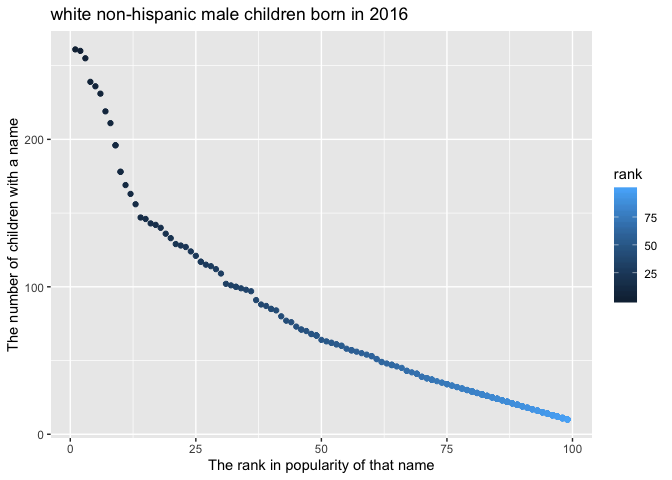

p8105\_hw2\_rw2708
================
Ran
9/25/2019

\#Problem 1 The chunk below serves to read and clean the Mr. Trash Wheel
sheet.

``` r
#read the excel file
wheel_data = read_excel("hw2data/Trash-Wheel-Collection-Totals-8-6-19.xlsx", skip = 1, sheet = 1) %>% 
    #use reasonable variable names
    janitor::clean_names() %>%
  
    #omit rows that do not include dumpster-specific data
    select(dumpster:homes_powered) %>%
    drop_na(dumpster) %>% 
    
    #round the number of sports balls to the nearest integer and converts the result to an integer variable
    mutate(sports_balls = round(sports_balls,digits = 0)) %>% 
    mutate(sports_balls = as.integer(sports_balls)) 

wheel_data
## # A tibble: 344 x 14
##    dumpster month  year date                weight_tons volume_cubic_ya…
##       <dbl> <chr> <dbl> <dttm>                    <dbl>            <dbl>
##  1        1 May    2014 2014-05-16 00:00:00        4.31               18
##  2        2 May    2014 2014-05-16 00:00:00        2.74               13
##  3        3 May    2014 2014-05-16 00:00:00        3.45               15
##  4        4 May    2014 2014-05-17 00:00:00        3.1                15
##  5        5 May    2014 2014-05-17 00:00:00        4.06               18
##  6        6 May    2014 2014-05-20 00:00:00        2.71               13
##  7        7 May    2014 2014-05-21 00:00:00        1.91                8
##  8        8 May    2014 2014-05-28 00:00:00        3.7                16
##  9        9 June   2014 2014-06-05 00:00:00        2.52               14
## 10       10 June   2014 2014-06-11 00:00:00        3.76               18
## # … with 334 more rows, and 8 more variables: plastic_bottles <dbl>,
## #   polystyrene <dbl>, cigarette_butts <dbl>, glass_bottles <dbl>,
## #   grocery_bags <dbl>, chip_bags <dbl>, sports_balls <int>,
## #   homes_powered <dbl>
```

The chunk below serves to read and clean the precipitation data for 2017
and 2018.

``` r
#read the excel file (2018 precipitation data)
precipitation2018_data = read_excel("hw2data/Trash-Wheel-Collection-Totals-8-6-19.xlsx",skip = 1, sheet = 5,range = "A2:B15") %>% 
  
  #use reasonable variable names
  janitor::clean_names() %>%
  
  # omit rows without precipitation data
  drop_na() %>% 
  
  # add a variable year 
  mutate(year = 2018)

precipitation2018_data
```

    ## # A tibble: 12 x 3
    ##    month total  year
    ##    <dbl> <dbl> <dbl>
    ##  1     1  0.94  2018
    ##  2     2  4.8   2018
    ##  3     3  2.69  2018
    ##  4     4  4.69  2018
    ##  5     5  9.27  2018
    ##  6     6  4.77  2018
    ##  7     7 10.2   2018
    ##  8     8  6.45  2018
    ##  9     9 10.5   2018
    ## 10    10  2.12  2018
    ## 11    11  7.82  2018
    ## 12    12  6.11  2018

``` r
#read the excel file (2017 precipitation data)
precipitation2017_data = read_excel("hw2data/Trash-Wheel-Collection-Totals-8-6-19.xlsx",skip = 1, sheet = 6,range = "A2:B14") %>% 
  
   #use reasonable variable names
  janitor::clean_names() %>%
  
  # omit rows without precipitation data
  drop_na() %>% 
  
  # add a variable year 
  mutate(year = 2017)

precipitation2017_data
```

    ## # A tibble: 12 x 3
    ##    month total  year
    ##    <dbl> <dbl> <dbl>
    ##  1     1  2.34  2017
    ##  2     2  1.46  2017
    ##  3     3  3.57  2017
    ##  4     4  3.99  2017
    ##  5     5  5.64  2017
    ##  6     6  1.4   2017
    ##  7     7  7.09  2017
    ##  8     8  4.44  2017
    ##  9     9  1.95  2017
    ## 10    10  0     2017
    ## 11    11  0.11  2017
    ## 12    12  0.94  2017

``` r
#combine the above two datasets
combine_data = bind_rows(precipitation2017_data, precipitation2018_data) %>% 
  janitor::clean_names() %>%
  
  #convert month to a character variable
  mutate(month = month.name[month])  

combine_data
```

    ## # A tibble: 24 x 3
    ##    month     total  year
    ##    <chr>     <dbl> <dbl>
    ##  1 January    2.34  2017
    ##  2 February   1.46  2017
    ##  3 March      3.57  2017
    ##  4 April      3.99  2017
    ##  5 May        5.64  2017
    ##  6 June       1.4   2017
    ##  7 July       7.09  2017
    ##  8 August     4.44  2017
    ##  9 September  1.95  2017
    ## 10 October    0     2017
    ## # … with 14 more rows

Description: 1) For the first dataset (wheel\_data), there exist 344
observations, with 14 variables, and it’s key variables are dumpster,
month, year, date, weight\_tons, volume\_cubic\_yards.The first four
variables dumpster, month, year, date indicate each dumpster at
different time, and the following two variablesweight\_tons,
volume\_cubic\_yards indicate the amount of trash that dumped into each
dumpster. 2) For the second dataset (precipitation2018\_data), it
contains the precipitation data in 2018. There exist 12 observations,
with 3 variables, and it’s key variables are month, total, year. 3) For
the third dataset (precipitation2017\_data), it contains the
precipitation data in 2017. There exist 12 observations, with 3
variables, and it’s key variables are month, total, year. 4) As for the
last dataset (combine\_data), it contains the precipitation data in 2017
and 2018. There exist 24 observations, with 3 variables, and it’s key
variables are month, total, year. These three variables indicate the
total precipitation in each month from 2017 to 2018.

Furthermore,the median number of sports balls in a dumpster in 2017 is
8. And the total precipitation in 2018 is 70.33.

\#Problem 2

``` r
#clean the data in pols-month.csv
pol_data = read_csv(file = "hw2data/pols-month.csv") %>% 
  janitor::clean_names() %>%
 separate(mon, into = c("year","month","day"), sep = "-") %>%
 mutate(month = as.integer(month)) %>% 
 mutate(month = month.name[month]) %>% 
  select(year, month, day, prez_gop,prez_dem, everything()) %>%
    pivot_longer(
    prez_gop:prez_dem,
    names_to = "president", 
    names_prefix = "prez_",
    values_to = "president_values") %>% 
    filter(president_values != "0") %>% 
    select(-day,-president_values)
```

    ## Parsed with column specification:
    ## cols(
    ##   mon = col_date(format = ""),
    ##   prez_gop = col_double(),
    ##   gov_gop = col_double(),
    ##   sen_gop = col_double(),
    ##   rep_gop = col_double(),
    ##   prez_dem = col_double(),
    ##   gov_dem = col_double(),
    ##   sen_dem = col_double(),
    ##   rep_dem = col_double()
    ## )

``` r
pol_data
```

    ## # A tibble: 822 x 9
    ##    year  month    gov_gop sen_gop rep_gop gov_dem sen_dem rep_dem president
    ##    <chr> <chr>      <dbl>   <dbl>   <dbl>   <dbl>   <dbl>   <dbl> <chr>    
    ##  1 1947  January       23      51     253      23      45     198 dem      
    ##  2 1947  February      23      51     253      23      45     198 dem      
    ##  3 1947  March         23      51     253      23      45     198 dem      
    ##  4 1947  April         23      51     253      23      45     198 dem      
    ##  5 1947  May           23      51     253      23      45     198 dem      
    ##  6 1947  June          23      51     253      23      45     198 dem      
    ##  7 1947  July          23      51     253      23      45     198 dem      
    ##  8 1947  August        23      51     253      23      45     198 dem      
    ##  9 1947  Septemb…      23      51     253      23      45     198 dem      
    ## 10 1947  October       23      51     253      23      45     198 dem      
    ## # … with 812 more rows

``` r
#clean the data in snp.csv using a similar process to the above
snp_data = read_csv(file = "hw2data/snp.csv") %>%
   janitor::clean_names() %>%
  separate(date, into = c("month","day","year"), sep = "/") %>%
  arrange(year,month) %>% 
  mutate(month = as.integer(month)) %>% 
  mutate(month = month.name[month]) %>% 
  select(-day) %>% 
  select(year, month, close)
```

    ## Parsed with column specification:
    ## cols(
    ##   date = col_character(),
    ##   close = col_double()
    ## )

``` r
snp_data
```

    ## # A tibble: 787 x 3
    ##    year  month    close
    ##    <chr> <chr>    <dbl>
    ##  1 1950  January   17.0
    ##  2 1950  October   19.5
    ##  3 1950  November  19.5
    ##  4 1950  December  20.4
    ##  5 1950  February  17.2
    ##  6 1950  March     17.3
    ##  7 1950  April     18.0
    ##  8 1950  May       18.8
    ##  9 1950  June      17.7
    ## 10 1950  July      17.8
    ## # … with 777 more rows

``` r
#tidy the unemployment data
unemployment_data = read_csv(file = "hw2data/unemployment.csv") %>%
               pivot_longer(
                 Jan:Dec,
                 names_to = "month",
                 values_to = "unemployment") %>% 
              rename(year = Year) %>% 
       mutate(year = as.character(year)) %>% 
       mutate(month = str_subset(month.name, str_to_sentence(month)))
```

    ## Parsed with column specification:
    ## cols(
    ##   Year = col_double(),
    ##   Jan = col_double(),
    ##   Feb = col_double(),
    ##   Mar = col_double(),
    ##   Apr = col_double(),
    ##   May = col_double(),
    ##   Jun = col_double(),
    ##   Jul = col_double(),
    ##   Aug = col_double(),
    ##   Sep = col_double(),
    ##   Oct = col_double(),
    ##   Nov = col_double(),
    ##   Dec = col_double()
    ## )

``` r
unemployment_data
```

    ## # A tibble: 816 x 3
    ##    year  month     unemployment
    ##    <chr> <chr>            <dbl>
    ##  1 1948  January            3.4
    ##  2 1948  February           3.8
    ##  3 1948  March              4  
    ##  4 1948  April              3.9
    ##  5 1948  May                3.5
    ##  6 1948  June               3.6
    ##  7 1948  July               3.6
    ##  8 1948  August             3.9
    ##  9 1948  September          3.8
    ## 10 1948  October            3.7
    ## # … with 806 more rows

``` r
#Join the datasets by merging snp into pols, and merging unemployment into the result.
pol_snp = left_join(pol_data,snp_data, by=c("year","month"))
 
final_data = left_join(pol_snp,unemployment_data, by = c("year","month"))

final_data
```

    ## # A tibble: 822 x 11
    ##    year  month gov_gop sen_gop rep_gop gov_dem sen_dem rep_dem president
    ##    <chr> <chr>   <dbl>   <dbl>   <dbl>   <dbl>   <dbl>   <dbl> <chr>    
    ##  1 1947  Janu…      23      51     253      23      45     198 dem      
    ##  2 1947  Febr…      23      51     253      23      45     198 dem      
    ##  3 1947  March      23      51     253      23      45     198 dem      
    ##  4 1947  April      23      51     253      23      45     198 dem      
    ##  5 1947  May        23      51     253      23      45     198 dem      
    ##  6 1947  June       23      51     253      23      45     198 dem      
    ##  7 1947  July       23      51     253      23      45     198 dem      
    ##  8 1947  Augu…      23      51     253      23      45     198 dem      
    ##  9 1947  Sept…      23      51     253      23      45     198 dem      
    ## 10 1947  Octo…      23      51     253      23      45     198 dem      
    ## # … with 812 more rows, and 2 more variables: close <dbl>,
    ## #   unemployment <dbl>

Description: 1) For the first dataset (pol\_data), which contains the
polls data for presidential election over time. The data has 822
observations, with 9 variables, and it’s key variables are gov\_dem,
gov\_gop, month, president, rep\_dem, rep\_gop, sen\_dem, sen\_gop,
year. Furthermore,the range of years is (1947, 2015). 2) For the second
dataset (snp\_data), which contains figures of a “close” variable over
time. The data has 787 observations, with 3 variables, and it’s key
variables are close, month, year. And the range of years is (1950,
2015). 3) For the third dataset (unemployment\_data), which contains the
unemployment information over time. The data has 816 observations, with
3 variables, and it’s key variables are month, unemployment, year. In
addition,the range of years is (1948, 2015). 4) For the last dataset
(final\_data), which consist of the above three datasets. It has 822
observations, with 11 variables, and it’s key variables are year, month
and president, close, unemployment.These variables indicate the party
that president comes from and unemployment information over time.
Furthermore,the range of years is (1947, 2015).

\#Problem 3

``` r
baby_names = read_csv(file = 'hw2data/Popular_Baby_Names.csv') %>% 
   janitor::clean_names() %>%
mutate(childs_first_name = str_to_sentence(childs_first_name)) %>% 
mutate(ethnicity = str_to_lower(ethnicity)) %>% 
mutate(ethnicity = replace(ethnicity,ethnicity == "white non hisp","white non hispanic")) %>% 
mutate(ethnicity = replace(ethnicity,ethnicity == "asian and paci","asian and pacific")) %>% 
mutate(ethnicity = replace(ethnicity,ethnicity == "black non hisp","black non hispanic")) %>% 
mutate(gender = str_to_lower(gender)) %>% 
distinct()
```

    ## Parsed with column specification:
    ## cols(
    ##   `Year of Birth` = col_double(),
    ##   Gender = col_character(),
    ##   Ethnicity = col_character(),
    ##   `Child's First Name` = col_character(),
    ##   Count = col_double(),
    ##   Rank = col_double()
    ## )

``` r
olivia_data = filter(baby_names, childs_first_name == 'Olivia') %>% 
  pivot_wider(id_cols = ethnicity,
              names_from = "year_of_birth",
              values_from = "rank") 

male_child = filter(baby_names, gender == 'male',rank == "1") %>% 
   pivot_wider(id_cols = ethnicity,
              names_from = "year_of_birth",
              values_from = "childs_first_name") 

male_white_nonhis = filter(baby_names, gender == "male", ethnicity == "white non hispanic", year_of_birth == "2016")

ggplot(male_white_nonhis,aes(x = rank ,y = count, color = rank)) + geom_point()
```

<!-- -->

The above scatter plot shows the number of male, white non-hispanic
children born in 2016 with a name (y axis) against the rank in
popularity of that name (x axis).The trend of the scatter plot is that
counts decrease from approximately 260 to nearly zero as rank increases
from 0 to 100.
